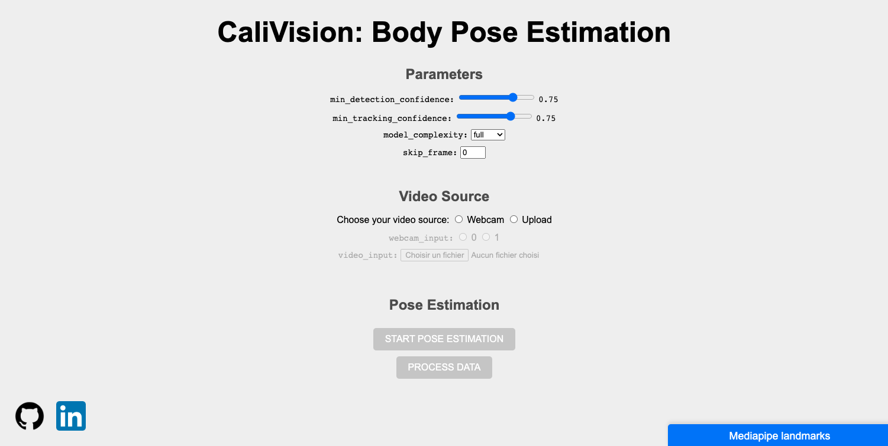
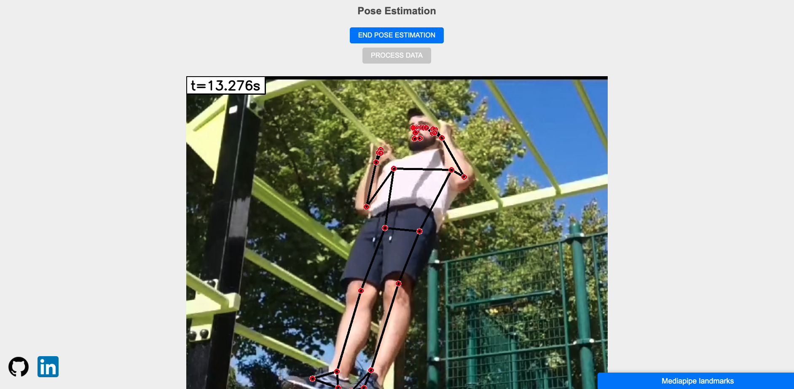
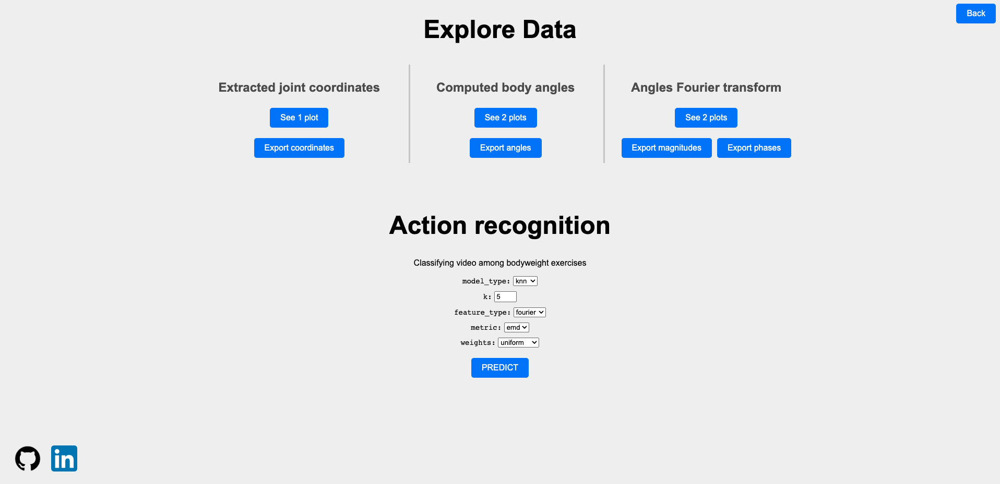
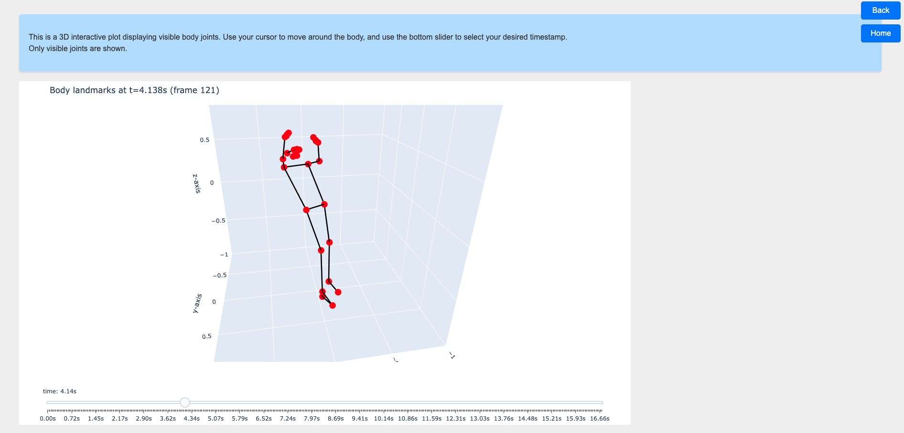
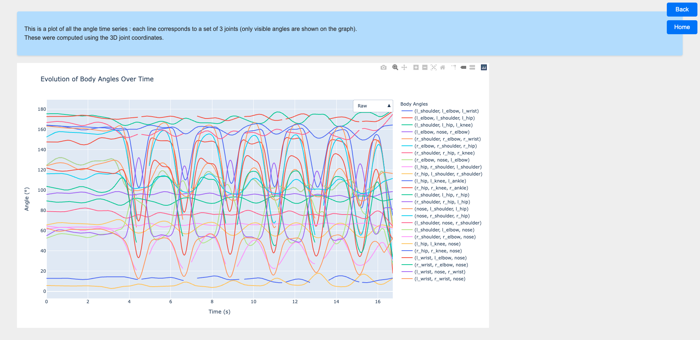
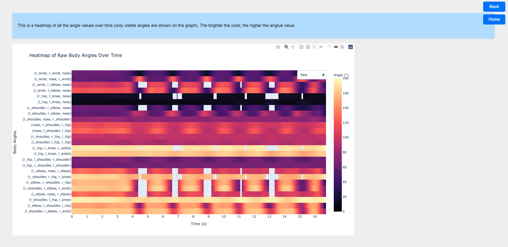
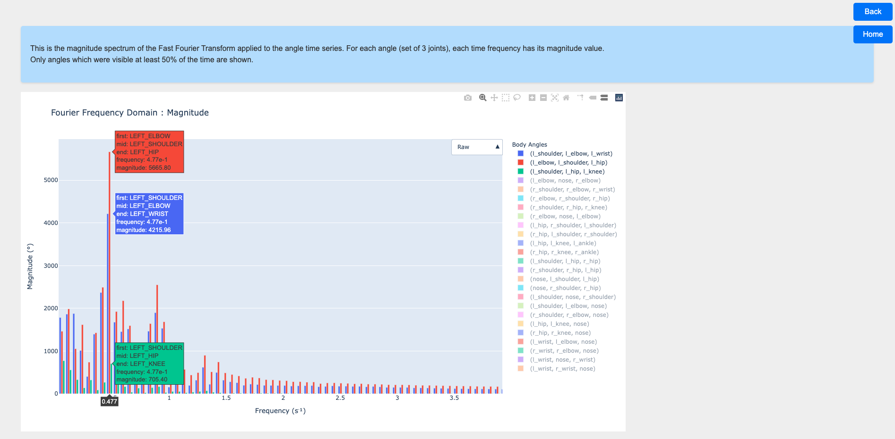
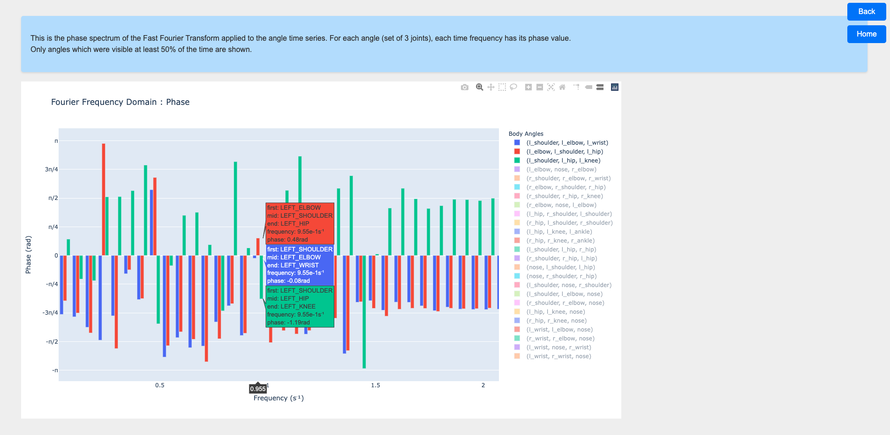
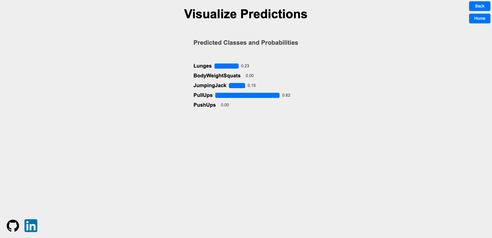

# Calivision - Your Fitness Companion

Calivision is a web application designed to enhance your fitness experience. It offers advanced body pose estimation and action recognition, making it the perfect tool for tracking your workouts.

## Features

1. **Body Pose Estimation**: Analyze body poses in real-time using your webcam or uploaded videos.

2. **Comprehensive Analysis**: Compute essential features and visualize interactive plots for better workout insights.

3. **Export Insights**: Export computed features like joint coordinate time series, angle evolution time series or Fourier transforms for in-depth analysis and sharing.

4. **Movement Classification**: Categorize your movements into five labels:
  - `BodyWeightSquats`
  - `JumpingJack`
  - `Lunges`
  - `PullUps`
  - `PushUps`

## Configuration Options

### Pose Estimation Parameters

CaliVision provides flexibility with various pose estimation parameters:

|         Parameter          | Description                                                                                                                     |
| :------------------------: | ------------------------------------------------------------------------------------------------------------------------------- |
| `min_detection_confidence` | The minimum confidence score for the pose detection to be considered successful                                                 |
| `min_tracking_confidence`  | The minimum confidence score for the pose tracking to be considered successful                                                  |
|     `model_complexity`     | Complexity of the pose landmark model. Landmark accuracy as well as inference latency generally go up with the model complexity |
|        `skip_frame`        | Number of frames to skip between two consecutive processed frames. Higher value means less processing time                      |

### Action Recognition Options

Choose from different methods for action recognition:

#### MODEL

> see [/src/models/](https://github.com/daltunay/calivision/blob/master/src/models/)

| Model  | Description                                                                                               |
| :----: | --------------------------------------------------------------------------------------------------------- |
| `lstm` | [Long Short-Term Memory](https://pytorch.org/docs/stable/generated/torch.nn.LSTM.html): PyTorch           |
| `knn`  | [k-Nearest Neighbors](https://en.wikipedia.org/wiki/K-nearest_neighbors_algorithm): custom implementation |

#### INPUT TYPE

> see [/src/features/](https://github.com/daltunay/calivision/blob/master/src/features/)

| Input Type | Description                                                                                                                                                                |
| :--------: | -------------------------------------------------------------------------------------------------------------------------------------------------------------------------- |
|  `joints`  | Input based on joint position coordinates (x, y, z) over time                                                                                                              |
|  `angles`  | Input based on body angles (see [/src/features/joints_data.yaml](https://github.com/daltunay/calivision/blob/master/src/features/joints_data.yaml) for the list) over time |
| `fourier`  | Input based on Fourier spectral domains (magnitude and phase)                                                                                                              |

#### METRIC

#### INPUT TYPE
> see [/src/features/](https://github.com/daltunay/calivision/blob/master/src/features/)

| Input Type | Description                                                                                                                                         |
| ---------- | --------------------------------------------------------------------------------------------------------------------------------------------------- |
| Joints     | Input based on joint position coordinates (x, y, z)                                                                                                 |
| Angles     | Input based on body angles (see [/src/features/joints_data.yaml](https://github.com/daltunay/calivision/blob/master/src/features/joints_data.yaml)) |
| Fourier    | Input based on Fourier spectral domains (magnitude and phase)                                                                                       |

#### METRIC
> see [/src/distance_metrics/](https://github.com/daltunay/calivision/blob/master/src/distance_metrics/)

| Metric | Description                                                                            |
| ------ | -------------------------------------------------------------------------------------- |
| `l1`   | [Manhattan distance](https://en.wikipedia.org/wiki/Taxicab_geometry)                   |
| `l2`   | [Euclidean distance](https://en.wikipedia.org/wiki/Euclidean_distance)                 |
| `dtw`  | [Dynamic Time Warping](https://en.wikipedia.org/wiki/Dynamic_time_warping)             |
| `lcss` | [Longest Common Subsequence](https://en.wikipedia.org/wiki/Longest_common_subsequence) |
| `emd`  | [Earth Mover's Distance](https://en.wikipedia.org/wiki/Earth_mover%27s_distance)       |

## Screenshots

### Front page

Here, you can select the pose estimation parameters as well as the input source. The two buttons enable you to start/stop the pose estimation, as well as process the data.


### Pose estimation

This is what shows when you start the pose estimation.


### Explore data

On this page, you have the choice between visualizing several plots, exporting the data, or perform action recognition.


### Interactive 3D joints visualization

This is the interactive 4D plot : `(x, y, z, t)`. Use the cursor to move through time.


### Angle evolution

As for the angles, there are two different plots on the page.
#### Time series

The first plot is a multivariate time series visualization, showing angle values over time. You can choose to normalize each angle time series, using the interactive buttton.

#### Heatmap

This second plot is a heatmap, which shows the same data as above but in another manner. You can choose to normalize the values horizontally, using the interactive buttton.


### Fourier transform

Once we have performed a FFT on the angle evolution data, we have access to the Fourier frequency spectrums.
#### Magnitude frequency domain

This shows the magnitude for each frequency value, for each angle.

#### Phase frequency domain

This shows the phase for each frequency value, for each angle.


### Action recognition

This is the page you land on after clicking on the prediction button. The results depend on the model and parameters you chose.

## Requirements

- Python >= 3.9
- Poetry (https://python-poetry.org/)

## Setup

0. (Optional) Install poetry:

```bash
pip install poetry
```

1. Clone this repository:

```bash
git clone https://github.com/daltunay/calivision.git
```

2. Navigate to the project directory:

```bash
cd calivision
```

3. Activate poetry shell and install dependencies:

```bash
poetry shell
poetry install
```

## Usage

To run web app, do the following:

```bash
cd app
flask run
```

Then go to **localhost**: http://127.0.0.1:5000/, and enjoy!
